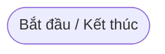
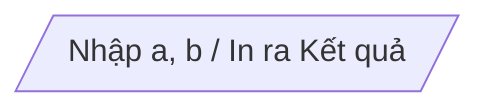
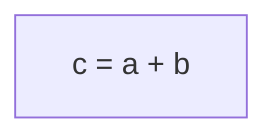
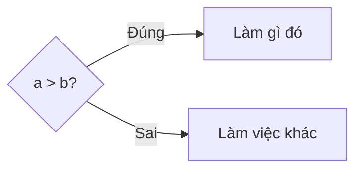
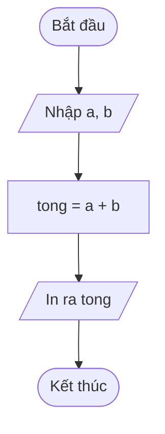
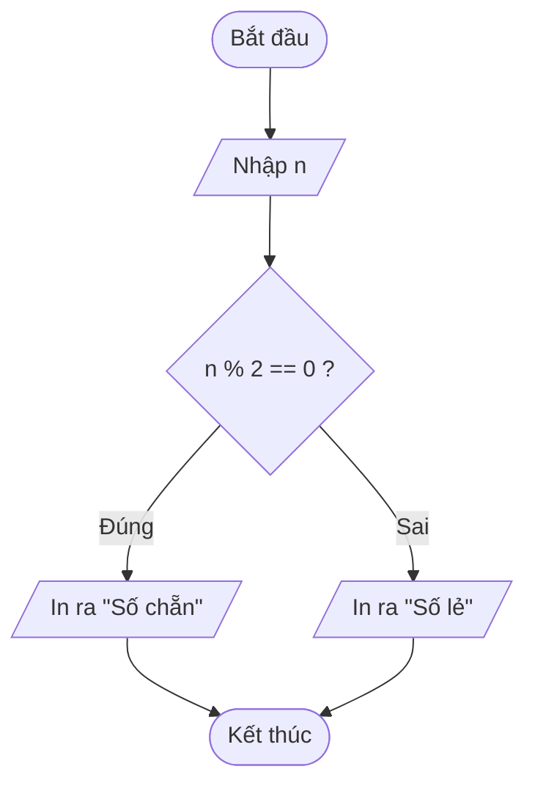
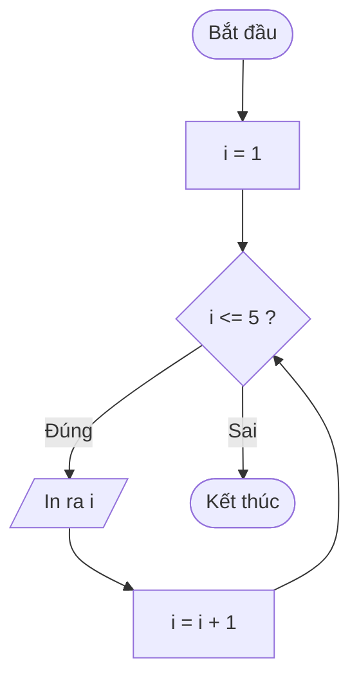
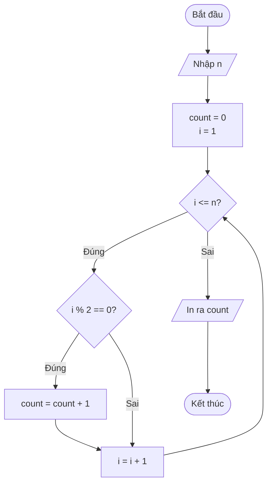

# Minh họa chương trình bằng sơ đồ khối

Sơ đồ khối (flowchart) là một công cụ trực quan để biểu diễn thuật toán hoặc một quá trình. Nó hiển thị các bước của chương trình dưới dạng các hình khối đặc trưng, được kết nối với nhau bằng các mũi tên để chỉ ra luồng thực thi (thứ tự các bước).

Sơ đồ khối giúp lập trình viên dễ dàng hình dung logic của chương trình trước khi bắt tay vào viết code, đồng thời cũng là công cụ giao tiếp hiệu quả khi làm việc nhóm.

---

## 1. Các ký hiệu cơ bản trong sơ đồ khối

Mỗi hình khối trong sơ đồ có một ý nghĩa riêng biệt. Dưới đây là các ký hiệu thường dùng nhất:

### Khối Bắt đầu / Kết thúc (Hình Oval / Elip)
- **Ý nghĩa:** Biểu diễn điểm bắt đầu (Start) hoặc kết thúc (End) của một thuật toán.
- **Hình dáng:** Hình bầu dục (Oval) hoặc hình chữ nhật bo tròn các góc.
- **Minh họa:**


### Khối Nhập / Xuất (Hình bình hành)
- **Ý nghĩa:** Biểu diễn thao tác nhận dữ liệu vào (Input) từ bàn phím/file, hoặc in dữ liệu ra (Output) màn hình/file.
- **Hình dáng:** Hình bình hành.
- **Minh họa:**


### Khối Xử lý / Tính toán (Hình chữ nhật)
- **Ý nghĩa:** Biểu diễn các câu lệnh tính toán, gán giá trị hoặc bất kỳ thao tác xử lý dữ liệu nào.
- **Hình dáng:** Hình chữ nhật.
- **Minh họa:**


### Khối Rẽ nhánh / Điều kiện (Hình thoi)
- **Ý nghĩa:** Biểu diễn một biểu thức điều kiện (đúng/sai). Luồng thực thi sẽ rẽ sang các hướng khác nhau tùy thuộc vào kết quả của điều kiện (Yes/No hoặc Đúng/Sai).
- **Hình dáng:** Hình thoi.
- **Minh họa:**


### Đường luồng (Mũi tên)
- **Ý nghĩa:** Chỉ hướng đi của chương trình từ bước này sang bước tiếp theo.
- **Hình dáng:** Đường thẳng có mũi tên ở một đầu.

---

## 2. Các cấu trúc lập trình cơ bản qua sơ đồ khối

Dưới đây là cách biểu diễn 3 cấu trúc điều khiển cơ bản trong lập trình (Tuần tự, Rẽ nhánh, Vòng lặp) thông qua sơ đồ khối:

### 2.1 Cấu trúc tuần tự (Sequential)
Các bước được thực hiện lần lượt từ trên xuống dưới.

**Ví dụ:** Nhập hai số $a$ và $b$, tính và in ra tổng của chúng.


### 2.2 Cấu trúc rẽ nhánh (Selection)
Sử dụng khối hình thoi để kiểm tra điều kiện.

**Ví dụ:** Nhập vào một số $n$, kiểm tra xem $n$ là số chẵn hay số lẻ và in kết quả.


### 2.3 Cấu trúc lặp (Iteration)
Sử dụng khối điều kiện kết hợp với đường luồng quay ngược lại các bước trước đó.

**Ví dụ:** In ra các số từ $1$ đến $5$.


---

## 3. Các ví dụ tổng hợp

### 3.1 Đếm số lượng các số chẵn từ 1 đến n
Thuật toán: Nhập số nguyên dương $n$. Sử dụng biến `count = 0` để đếm. Duyệt biến `i` từ 1 đến $n$, nếu `i` chẵn (`i % 2 == 0`) thì tăng `count` lên 1. Cuối cùng in ra kết quả `count`.



### 3.2 Thuật toán Tìm kiếm nhị phân (Binary Search)
**Bài toán:** Cho một mảng `A` đã được sắp xếp tăng dần và một giá trị `x`. Tìm xem `x` có tồn tại trong mảng `A` hay không.

**Thuật toán:** Dùng hai chỉ số `left` và `right` để đánh dấu khoảng đang tìm kiếm. Kiểm tra phần tử ở giữa `mid`.
- Nếu `A[mid] == x`, tìm thấy và kết thúc.
- Nếu `A[mid] < x`, giới hạn khoảng tìm kiếm ở nửa bên phải (`left = mid + 1`).
- Nếu `A[mid] > x`, giới hạn khoảng tìm kiếm ở nửa bên trái (`right = mid - 1`).
- Quá trình lặp lại đến khi `left > right` thì dừng lại (không tìm thấy).

```mermaid
flowchart TD
    Start([Bắt đầu]) --> Input[/Nhập mảng A, giá trị x/]
    Input --> Init[left = 0<br/>right = n - 1]
    
    Init --> LoopCond{left <= right?}
    
    LoopCond -- Đúng --> CalcMid[mid = trung bình cộng của left và right]
    CalcMid --> CheckEqual{A[mid] == x?}
    
    CheckEqual -- Đúng --> Found[/In ra 'Tìm thấy ở vị trí mid'/]
    CheckEqual -- Sai --> CheckLess{A[mid] < x?}
    
    CheckLess -- Đúng --> GoRight[left = mid + 1]
    CheckLess -- Sai --> GoLeft[right = mid - 1]
    
    GoRight --> LoopCond
    GoLeft --> LoopCond
    
    LoopCond -- Sai --> NotFound[/In ra 'Không tìm thấy'/]
    
    Found --> End([Kết thúc])
    NotFound --> End
```

---

## 4. Lời khuyên khi vẽ sơ đồ khối
- Luôn có một điểm **Bắt đầu** và một (hoặc nhiều) điểm **Kết thúc**.
- Đường mũi tên chỉ nên đi theo một chiều (thường là từ trên xuống dưới, hoặc từ trái sang phải), tránh vẽ các đường vòng vèo rối rắm.
- Nội dung bên trong mỗi khối nên viết ngắn gọn, súc tích (thường là mã giả - pseudocode hoặc công thức toán học).
- Đối với khối điều kiện (hình thoi), luôn phải có ít nhất 2 nhánh thoát ra (ví dụ: Đúng và Sai).
